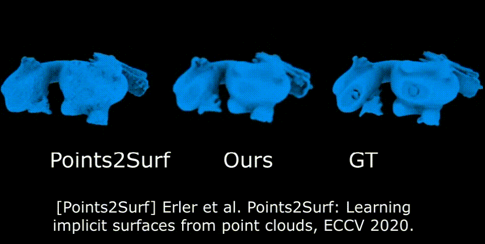
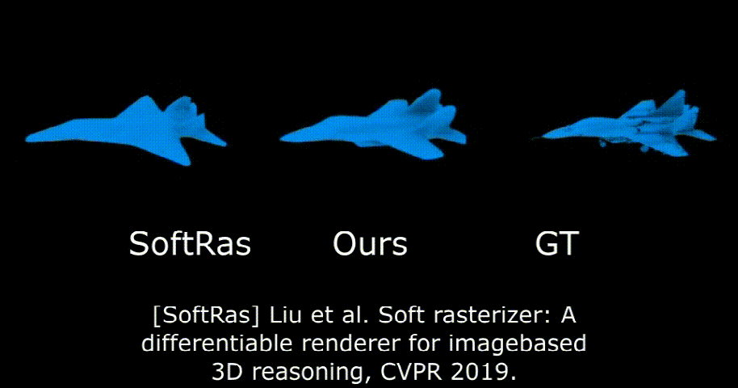

# NeuralPull

## Surface Reconstruction Demo
<p align="left">
  
   
</p>

## Single Image Reconstruction Demo
<p align="left">
  
</p>
This repository contains the code to reproduce the results from the paper.
[Neural-Pull: Learning Signed Distance Functions from Point Clouds by Learning to Pull Space onto Surfaces](http://cgcad.thss.tsinghua.edu.cn/liuyushen/index.html).
You can find detailed usage instructions for training your own models and using pretrained models below.

If you find our code or paper useful, please consider citing

    @inproceedings{NeuralPull,
        title = {Neural-Pull: Learning Signed Distance Functions from Point Clouds by Learning to Pull Space onto Surfaces},
        author = {Baorui, Ma and Zhizhong, Han and Yu-shen, Liu and Matthias, Zwicker},
        booktitle = {International Conference on Machine Learning (ICML)},
        year = {2021}
    }

## Installation
First you have to make sure that you have all dependencies in place.
The simplest way to do so, is to use [anaconda](https://www.anaconda.com/). 

You can create an anaconda environment called `mesh_funcspace` using
```
conda env create -f NeuralPull.yaml
conda activate tensorflow1
```

Next, for evaluation of the models,compile the extension modules, which are provided by [Occupancy Networks](https://github.com/autonomousvision/occupancy_networks).
You can do this via
```
python setup.py build_ext --inplace
```

To compile the dmc extension, you have to have a cuda enabled device set up.
If you experience any errors, you can simply comment out the `dmc_*` dependencies in `setup.py`.
You should then also comment out the `dmc` imports in `im2mesh/config.py`.


## Dataset

1. You can [download](http://cgcad.thss.tsinghua.edu.cn/liuyushen/index.html) our preprocessed data.
2. To make it easier for you to test the code, we have prepared exmaple data in the exmaple_data folder.


### Generation
To generate meshes using a trained model, use
```
python generate.py CONFIG.yaml
```
where you replace `CONFIG.yaml` with the correct config file.

The easiest way is to use a pretrained model.
You can do this by using one of the config files
```
configs/img/onet_pretrained.yaml
configs/pointcloud/onet_pretrained.yaml
configs/voxels/onet_pretrained.yaml
configs/unconditional/onet_cars_pretrained.yaml
configs/unconditional/onet_airplanes_pretrained.yaml
configs/unconditional/onet_sofas_pretrained.yaml
configs/unconditional/onet_chairs_pretrained.yaml
```
which correspond to the experiments presented in the paper.
Our script will automatically download the model checkpoints and run the generation.
You can find the outputs in the `out/*/*/pretrained` folders.

Please note that the config files  `*_pretrained.yaml` are only for generation, not for training new models: when these configs are used for training, the model will be trained from scratch, but during inference our code will still use the pretrained model.

### Evaluation
For evaluation of the models and generation meshes using a trained model, use

```
python NeuralPull.py --data_dir /data1/mabaorui/AtlasNetOwn/data/plane_precompute_2/ --out_dir /data1/mabaorui/AtlasNetOwn/plane_cd_sur/ --class_idx 02691156 --save_idx -1
```

### Training
You can train a new network from scratch, run

```
python NeuralPull.py --data_dir /data1/mabaorui/AtlasNetOwn/data/plane_precompute_2/ --out_dir /data1/mabaorui/AtlasNetOwn/plane_cd_sur/ --class_idx 02691156 --train
```
### Script Parameter Explanation

|Parameters  |Description |
|:---------------|:----------------------------|
|src            |Source 8-bit or floating-point, 1-channel or 3-channel image.      |
|dst           |Destination image of the same size and type as src.      |


# Notes
* In our paper we used random crops and scaling to augment the input images. 
  However, we later found that this image augmentation decreases performance on the ShapeNet test set.
  The pretrained model that is loaded in `configs/img/onet_pretrained.yaml` was hence trained without data augmentation and has slightly better performance than the model from the paper. The updated table looks a follows:
  
  For completeness, we also provide the trained weights for the model which was used in the paper in  `configs/img/onet_legacy_pretrained.yaml`.
* Note that training and evaluation of both our model and the baselines is performed with respect to the *watertight models*, but that normalization into the unit cube is performed with respect to the *non-watertight meshes* (to be consistent with the voxelizations from Choy et al.). As a result, the bounding box of the sampled point cloud is usually slightly bigger than the unit cube and may differ a little bit from a point cloud that was sampled from the original ShapeNet mesh.

# Futher Information
Please also check out the following concurrent papers that have proposed similar ideas:
* [Park et al. - DeepSDF: Learning Continuous Signed Distance Functions for Shape Representation (2019)](https://arxiv.org/abs/1901.05103)
* [Chen et al. - Learning Implicit Fields for Generative Shape Modeling (2019)](https://arxiv.org/abs/1812.02822)
* [Michalkiewicz et al. - Deep Level Sets: Implicit Surface Representations for 3D Shape Inference (2019)](https://arxiv.org/abs/1901.06802)
